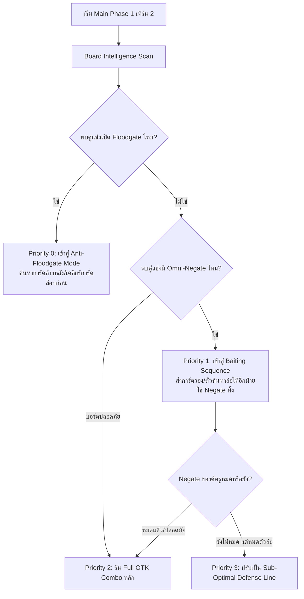

# รายงานวิเคราะห์จุดคอขวด AI และพิมพ์เขียวการยกระดับการอ่านบอร์ด
## (AI Board Reading & Execution Gap Analysis Blueprint)

- **วันที่จัดทำ**: 2 ตุลาคม 2026
- **สถานะ**: ข้อเสนอเชิงสถาปัตยกรรมและแผนการพัฒนา (Architectural Proposal & Roadmap)
- **ขอบเขต**: WindBot ModernExecutor, Central Intelligence, และ Deck Plugins

---

## 1. บทนำและปัญหาที่พบ (Executive Summary)

### สภาพปัจจุบัน
ระบบ WindBot Rule-Based Executor ในปัจจุบันมีความสามารถในการ **เดินคอมโบเชิงรุก (Proactive Combo Execution) และปิดเกมด้วย OTK ในเทิร์นแรกได้อย่างยอดเยี่ยม** เมื่อเงื่อนไขในมือครบและไม่มีสิ่งกีดขวาง

### ปัญหาหลักที่ต้องแก้ไข (The Core Problem)
เมื่อเข้าสู่สถานการณ์โต้ตอบจริง โดยเฉพาะ:
1. **การเล่นเทิร์น 2 (Going Second)** เมื่อฝ่ายตรงข้ามตั้งบอร์ดเสร็จแล้ว
2. **การขัดขวางในเทิร์นฝ่ายตรงข้าม (Interruption Timing)**
3. **การเผชิญหน้ากับการ์ดล็อกสนาม (Floodgates)**

บอทแสดงความผิดพลาดเชิงตรรกะซ้ำๆ เช่น ยิง Handtrap ใส่การ์ดล่อ (Bait), เดินคอมโบหลักชน Omni-Negate ของศัตรูตรงๆ จนพัง, และเลือกเป้าหมายการ์ดทำลาย/แบนิชโดยดูจากพลังโจมตี (ATK) มากกว่าระดับความอันตรายของเอฟเฟกต์

---

## 2. บทวิเคราะห์เปรียบเทียบ: Tag Force vs WindBot

| คุณลักษณะ | AI ของ YGO Tag Force (PSP Engine) | WindBot ModernExecutor (C# .NET) |
| :--- | :--- | :--- |
| **แกนหลักของระบบ** | **Generic Utility Scoring Engine**<br>(คำนวณคะแนน Board Advantage + LP delta) | **Rule-Based Expert System**<br>(ต้นไม้การตัดสินใจ + คอมโบเฉพาะเด็ค) |
| **จุดเด่น** | มีการชั่งน้ำหนัก Action Value ค่อนข้างสม่ำเสมอในทุกเทิร์น | เล่นคอมโบประจำเด็คได้ลึก เป๊ะ และรุนแรงระดับ OTK |
| **จุดด้อย** | เอ๋อบ่อยในคอมโบซับซ้อน, ไม่รู้จัก Link/Pendulum/Handtrap ยุคใหม่ | มักเล่นแบบ Reactive เฉพาะหน้า ขาดการมองภาพรวมกระดานศัตรู |
| **การนำมาปรับใช้** | โค้ด MIPS Assembly โบราณแปลงตรงๆ ไม่ได้ **แต่นำแนวคิด Threat Matrix มาใช้ได้** | เป็นรากฐานที่ถูกต้องแล้ว เพียงแต่ต้องผูก Core Intelligence เข้ากับ Deck Executors |

---

## 3. การค้นพบจุดคอขวด: "The Execution Gap"

จากการตรวจสอบซอร์สโค้ดในโปรเจกต์ พบว่า **"คอร์กลางฉลาดและมีฟังก์ชันประเมินบอร์ดอยู่แล้ว แต่ Executor ของแต่ละเด็คไม่ได้เรียกใช้"**

### ตัวอย่างหลักฐานจากโค้ดจริง

#### 1) การใช้ Handtrap แบบ Shotgun (ใน `KashtiraExecutor.cs` บรรทัด 181-184):
```csharp
private bool AshBlossomCondition()
{
    // ❌ เรียก DefaultAshBlossom ตรงๆ ทำให้กดยิงสวนทันทีที่เห็นเอฟเฟกต์เด้งถาม
    return DefaultAshBlossomAndJoyousSpring(); 
}
```

#### 2) การเลือกเป้าหมายแบบดูแค่ ATK (ใน `KashtiraExecutor.cs` บรรทัด 247-248):
```csharp
// ❌ สั่งแบนิชการ์ดศัตรูโดยดูจากมอนสเตอร์ที่มี Attack สูงสุด
var banishTarget = Enemy.GetMonsters()
    .Where(m => m.IsFaceup())
    .OrderByDescending(m => m.Attack) 
    .FirstOrDefault();
```

> **ผลลัพธ์ในเกมจริง**:  
> หากศัตรูมี **Apollousa** (ATK 0-1600 มี 3 Negates) หรือ **Bagooska** (ตัวบล็อกเอฟเฟกต์) ยืนคู่กับมอนสเตอร์ ATK 3000 บอทจะเลือกแบนิชตัว 3000 เสมอ เพราะดูแค่พลังโจมตี ละเลยตัวอันตรายสูงสุดบนกระดานไปอย่างสิ้นเชิง

---

## 4. ชำแหละ 4 จุดบอดของการอ่านบอร์ด (The 4 Fundamental Flaws)

```
┌────────────────────────────────────────────────────────────────────────┐
│                      4 จุดบอดหลักของการอ่านบอร์ด                        │
├────────────────────────────────┬───────────────────────────────────────┤
│ 1. Shotgun Effect & Bait Trap  │ โดนการ์ดจั่ว/ค้นตัวล่อหลอกกิน Handtrap │
│ 2. No Threat Defusal (Turn 2)  │ ปล่อย Starter หลักไปชน Negate ตายเอง   │
│ 3. Floodgate Blindness         │ ฝืนรันคอมโบทั้งที่ติด Skill Drain/Dweller│
│ 4. Blind Target Selection      │ เล็งยิงตาม ATK ไม่ได้เล็งตาม Threat เกรด│
└────────────────────────────────┴───────────────────────────────────────┘
```

1. **Shotgun Effect & Bait Trap**:
   - บอทไม่รู้ว่าการ์ดไหนคือ *Bait* (เช่น `Pot of Extravagance`, `Upstart Goblin`) กับการ์ดไหนคือ *Chokepoint* (เช่น `Branded Fusion`, `Snake-Eye Ash`)
   - ส่งผลให้บอทใช้ทรัพยากรขัดขวางหมดไปตั้งแต่ก้าวแรกของศัตรู

2. **ขาดขั้นตอน Threat Defusal & Bait Routine ในเทิร์น 2**:
   - ผู้เล่นระดับทัวร์นาเมนต์เมื่อเล่นเทิร์น 2 จะประเมิน Negate บนสนามศัตรูก่อน หากมี 2 Negates จะส่งการ์ดตัวรองไปบังคับให้อีกฝ่ายกดใช้ (Bait Out) ก่อนปล่อย Starter หลัก
   - บอทในปัจจุบันจะส่ง Starter หลักลงไปทันทีใน Step 1 พอโดน Negate คอมโบก็พังทลายทันที

3. **ความบอดต่อ Floodgates & Continuous Effects**:
   - เมื่อเจอการ์ดล็อกกระดาน เช่น `Skill Drain`, `There Can Be Only One`, `Abyss Dweller`, หรือ `Bagooska` ท่ายืนป้องกัน
   - บอทไม่ได้เปลี่ยนลำดับความสำคัญของเทิร์นเป็นการค้นหาการ์ดทำลายเวท/กับดักก่อน แต่ยังดึงดันรันคอมโบมอนสเตอร์จนทรัพยากรสูญเปล่า

4. **Blind Target Selection**:
   - การสั่งใช้งานเอฟเฟกต์ทำลาย, สั่งแบนิช, หรือสั่งคว่ำการ์ด (Book of Moon, S:P Little Knight, Fenrir) ขาดการชั่งน้ำหนัก Priority

---

## 5. พิมพ์เขียวสถาปัตยกรรมใหม่ (Pro-Player AI Blueprint)

### 5.1 ผังการตัดสินใจเทิร์น 2 (Going Second Decision Flow)



---

### 5.2 มาตรฐาน Unified Target Matrix (ระบบเกรดความอันตราย)

ทุก Executor ต้องยกเลิกการเลือกเป้าหมายตาม ATK และเปลี่ยนมาใช้เกรดความสำคัญ:

| เกรด | คำจำกัดความ | ตัวอย่างการ์ด | ลำดับการตกเป็นเป้าหมาย |
| :---: | :--- | :--- | :---: |
| **Grade S** | **Floodgates & Hard Locks**<br>(การ์ดที่ล็อกทั้งกระดาน) | Skill Drain, Bagooska, Winda, Colossus, Abyss Dweller, TCBOO | **อันดับ 1 (สูงสุด)** |
| **Grade A** | **Omni-Negates & Quick Disrupts**<br>(บอสที่มีเอฟเฟกต์ขัดขวางจังหวะ) | Baronne de Fleur, Apollousa, Borreload Savage, Dis Pater, S:P Little Knight | **อันดับ 2** |
| **Grade B** | **Starters & Essential Engines**<br>(การ์ดตั้งต้นและฟิวชันหลัก) | Snake-Eye Ash, Branded Fusion, Aluber, Circular, Mo Ye | **อันดับ 3 (จุดขัด Handtrap)** |
| **Grade C** | **Vanilla & Pure Beatsticks**<br>(มอนสเตอร์พลังโจมตีสูงแต่ไร้เอฟเฟกต์ขัด) | Blue-Eyes White Dragon, มอนสเตอร์ที่เอฟเฟกต์ถูกปิดไปแล้ว | **อันดับสุดท้าย** |

---

### 5.3 กลยุทธ์ Handtrap Budgeting (การบริหารไพ่ขัดจังหวะ)

ใน [ChainTimingAdvisor.cs](file:///c:/Users/admin/Documents/EdoGame/src/YGO_SOURCE_CLEAN/windbot-fork/ExecutorBase/Game/AI/ChainTimingAdvisor.cs) จะมีการจัดกลุ่มการ์ดเพื่อป้องกันการตกหลุมพราง Bait:

1. **ห้าม Ash ใส่การ์ดจั่วทั่วไป** (`Pot of Extravagance`, `Pot of Duality`, `Upstart Goblin`) **หากในมือมี Handtrap เพียง 1 ใบ** (ต้องสงวนไว้ให้ Chokepoint)
2. **ข้อยกเว้น**: อนุญาตให้ Ash ใส่ Pot ได้เฉพาะเมื่อในมือมี Handtrap สำรองตั้งแต่ 2 ใบขึ้นไป หรือทราบว่าอีกฝ่ายเล่นเด็คประเภท Stun
3. **ล็อกเป้า Chokepoint ที่แท้จริง**:
   - ขัด Normal Summon ตัวแรกของเทิร์นทันที
   - ขัดเวทฟิวชัน/พิธีกรรมจากเด็ค (`Branded Fusion`, `Nadir Servant`) ทันที

---

## 6. ตัวอย่างการเขียนโค้ด: ก่อนและหลังปรับปรุง (Code Migration Example)

### โค้ดแบบเดิม (Naive / Unsharp)
```csharp
// สั่ง Fenrir แบนิชการ์ด
private bool FenrirBanish()
{
    var target = Enemy.GetMonsters().OrderByDescending(m => m.Attack).FirstOrDefault();
    if (target != null) { AI.SelectCard(target); return true; }
    return false;
}
```

### โค้ดแบบใหม่ (Pro-Player / Central Intelligence)
```csharp
// สั่ง Fenrir แบนิชการ์ดผ่าน BoardScorer
private bool FenrirBanish()
{
    // เรียก Central Threat Intelligence คำนวณ Grade S และ Grade A ก่อน
    ClientCard target = Scorer.GetBestRemovalTarget();
    if (target != null)
    {
        AI.SelectCard(target);
        return true;
    }
    return false;
}
```

---

## 7. แผนการดำเนินงานยกระดับ (Phased Implementation Plan)

1. **ระยะที่ 1: เชื่อมต่อ Central Scorer เข้าสู่ Deck Executors (Enforce Execution)**
   - ทบทวน Deck Executors สำคัญ (เช่น Kashtira, Branded, Spright, Snake-Eye)
   - แทนที่คำสั่ง `OrderByDescending(Attack)` ด้วย `Scorer.GetBestRemovalTarget()`
   - แทนที่ `DefaultAshBlossom()` ด้วย `ChainTimingAdvisor.ShouldInterrupt()`

2. **ระยะที่ 2: เพิ่ม Baiting Routine ใน ComboRouter**
   - พัฒนาโครงสร้าง Route ให้รองรับเงื่อนไข `HasEnemyDisruption`
   - แบ่งหมวดหมู่การ์ดในมือเป็น `BaitCandidates` และ `CoreStarters`

3. **ระยะที่ 3: Pilot Test และ Audit สถิติผ่าน Headless Simulator**
   - รันการจำลองดวล 50-100 แมตช์กับบอทสายตั้งบอร์ด (เช่น Altergeist, Kashtira, Spright)
   - ตรวจสอบอัตรา Win Rate เทิร์น 2 (Going Second Win Rate) เปรียบเทียบก่อนและหลังปรับปรุง
